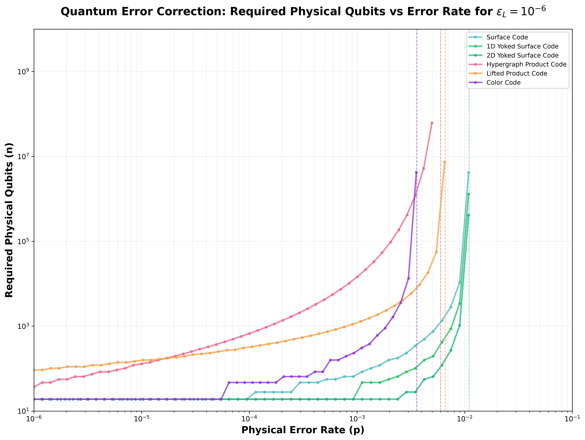

# Quantum Error Correction Resource Estimator


[](https://codecov.io/gh/francois-marie/quantum-resource-estimator)

An interactive web tool for estimating quantum computing resource requirements with different error correction codes. This tool helps researchers and engineers understand the physical qubit requirements for fault-tolerant quantum computation across different regimes.

## Features

- **Multiple Error Correction Codes:**
  - Surface Code
  - 1D Yoked Surface Code
  - 2D Yoked Surface Code
  - Hypergraph Product Code
  - Lifted Product Code
  - Color Code

- **Interactive Calculator:**
  - Adjustable parameters for physical error rate (p)
  - Target logical error rate (epsilon_L)
  - Number of physical and logical qubits
  - Real-time calculation of code distance and resource requirements

- **Comprehensive Visualization:**
  - Interactive plot showing required physical qubits vs error rate
  - Logarithmic scales for better visualization of wide parameter ranges
  - Tooltips for detailed information

## Visualization



The plot above shows the relationship between physical error rates and the number of required physical qubits for different quantum error correction codes, targeting a logical error rate of 10^-6. The plot includes surface codes, yoked surface codes (1D and 2D variants that use outer parity checks for better error suppression), and LDPC codes (hypergraph and lifted product). The dashed vertical lines indicate the error threshold for each code -- no quantum error correction can work when the physical error rate exceeds these thresholds.

- **Quantum Computing Regimes:**
  - KiloQuop (epsilon_L = 10^-3)
  - MegaQuop (epsilon_L = 10^-6)
  - GigaQuop (epsilon_L = 10^-9)
  - TeraQuop (epsilon_L = 10^-12)
  - PetaQuop (epsilon_L = 10^-15)

## Formulas and References

### Surface Code
- LFR(surface) = 0.03k(p/0.011)^ceil(floor(sqrt(n/k))/2)
- Threshold ~= 1.1%
- Reference: [Surface code quantum communication (Fowler et al., 2010)](https://arxiv.org/abs/0910.4074)

### 1D Yoked Surface Code
- LFR(1D-yoked) = 0.03k(p/0.011)^ceil((mu_1D * sqrt(n/k))/2)
- mu_1D ~= 1.8 (distance multiplier for 1D yoke)
- Threshold ~= 1.1% (same as surface code)

### 2D Yoked Surface Code
- LFR(2D-yoked) = 0.03k(p/0.011)^ceil((mu_2D * sqrt(n/k))/2)
- mu_2D ~= 3.2 (distance multiplier for 2D yoke)
- Threshold ~= 1.1% (same as surface code)

Yoked surface codes use outer parity checks to effectively increase the code distance for better error suppression. Reference: [Yoked surface codes (Gidney et al., 2023)](https://arxiv.org/abs/2312.04522)

### Hypergraph Product Code
- LFR(HGP) = 0.07(p/0.006)^(0.47n^0.27)
- Threshold ~= 0.6%

### Lifted Product Code
- LFR(LP) = 2.3(p/0.0066)^(0.11n^0.60)
- Threshold ~= 0.66%

Reference for HGP and LP codes: [Constant-Overhead Fault-Tolerant Quantum Computation with Reconfigurable Atom Arrays (Xu et al., 2023)](https://arxiv.org/abs/2308.08648v1)

### Color Code
- LFR(color) = 0.03k(p/0.0036)^ceil(d/2)
- Threshold ~= 0.36% (circuit-level noise)
- d ~= sqrt(n/k) for triangular honeycomb (6.6.6) patches

Formula for triangular color code patches. Steane code [[7,1,3]] is the d=3 member. Uses the same functional form as surface code but with [lower threshold for circuit-level noise](https://doi.org/10.1103/PRXQuantum.5.030352).

## Getting Started

### Prerequisites
- Node.js (v14 or higher)
- npm (v6 or higher)

### Installation

1. Clone the repository:

```bash
git clone https://github.com/francois-marie/quantum-resource-estimator.git
cd quantum-resource-estimator
```

2. Install dependencies:
```bash
npm install
```

3. Start the development server:
```bash
npm start
```

The application will be available at [http://localhost:3000](http://localhost:3000)

## Testing

This project includes comprehensive test coverage with 90+ tests covering:

- **Mathematical Calculations**: Validation of quantum error correction formulas
- **Component Rendering**: UI components and user interactions
- **Utility Functions**: Helper functions and edge cases
- **Integration Tests**: Full application workflow testing

### Running Tests

```bash
# Run all tests
npm test

# Run tests with coverage
npm test -- --coverage

# Run tests in watch mode for development
npm test -- --watch
```

### Generating Static Plot

To regenerate the static plot for the README:

```bash
# Install Python dependencies (one-time setup)
pip3 install -r requirements-plot.txt

# Generate the plot
npm run generate-plot

# Or run directly with Python
python3 scripts/generate-plot.py
```

This will create or update the plot image at `images/quantum-error-correction-plot.png`.

### Test Coverage

Current test coverage includes:
- [x] Surface Code calculations and edge cases
- [x] Hypergraph Product Code formulas
- [x] Lifted Product Code algorithms
- [x] Color Code implementations
- [x] User interface interactions
- [x] URL parameter handling
- [x] Plot data generation
- [x] Mathematical constants validation

## Deployment

The application is deployed using Netlify. The deployment is automatically triggered when changes are pushed to the main branch.

Visit the live version at: [https://francoismarieleregent.xyz/quantum-resource-estimator/](https://francoismarieleregent.xyz/quantum-resource-estimator/)

## Contributing

This is a work in progress. If you find bugs or have suggestions for improvements, please:

1. Check existing issues or create a new one
2. Fork the repository
3. Create a new branch for your feature
4. Submit a pull request

## License

This project is licensed under the MIT License - see the [LICENSE](LICENSE) file for details.

## Acknowledgments

- Inspired by discussions in [Quantum Computing Report](https://quantumcomputingreport.com/nisq-versus-ftqc-in-the-2025-2029-timeframe/)
- Built with React and Chart.js
- Styling with Tailwind CSS

## Author

[François-Marie Le Régent](https://francoismarieleregent.xyz/)

## Status

🚧 This project is under active development. Features and calculations are being refined and verified. Please create issues on GitHub if you find any bugs or have suggestions for improvements.
